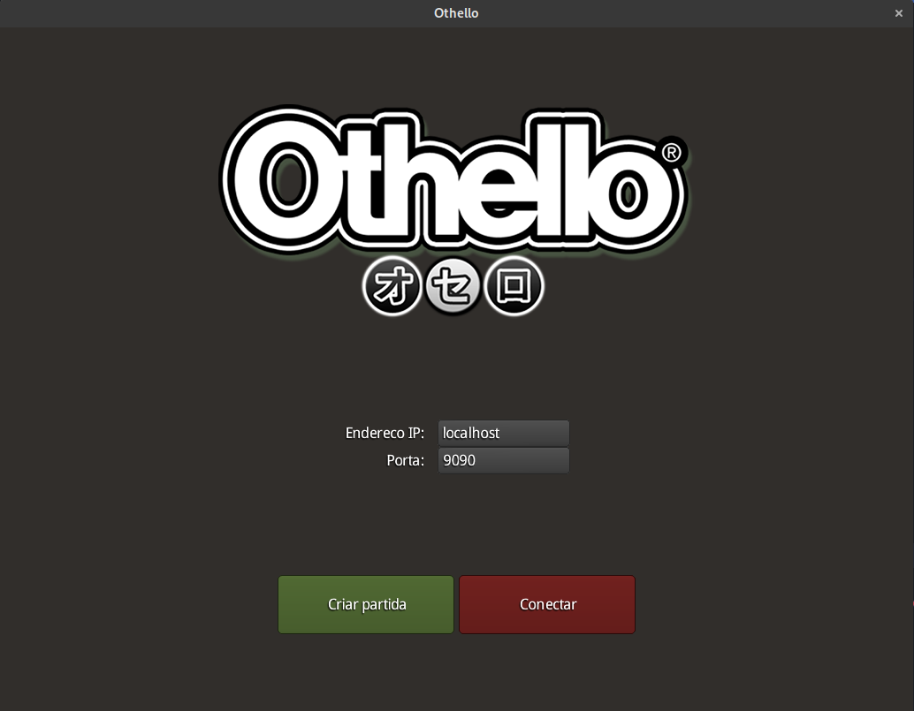
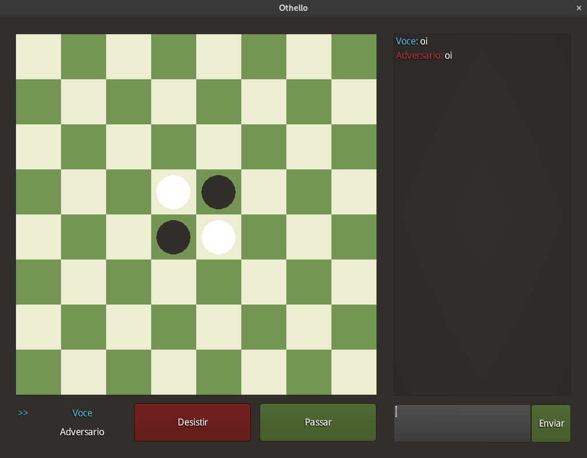

# Othello

Implementação do jogo othello usando a biblioteca libGDX.

Esse programa foi feito para a disciplina de Programação Paralela e Distribuida do curso de engenharia da computação
no IFCE do semestre 2021.1.
O objetivo era utilizar [sockets](https://en.wikipedia.org/wiki/Berkeley_sockets) para implementar a comunicação
peer-to-peer entre os aplicativos clientes.

Como o foco era a comunicação entre aplicativos as regras do jogo não foram implementadas, cada jogador pode adicionar,
virar ou remover qualquer peça. Outro requisito do trabalho era o chat, sistema de passagem de turno, desistência e
checagem do vencedor.

    

	

## Autor

* **Rafael Coelho** - [rafaellcoellho](https://github.com/rafaellcoellho)

## Referências 

+ [FBO - Federação Brasileira de Othello](http://www.othellobrasil.com.br/)
+ [Regras](https://www.youtube.com/watch?v=Ol3Id7xYsY4)
+ [Wiki libGDX](https://github.com/libgdx/libgdx/wiki)
+ [Javadocs do libGDX](https://libgdx.badlogicgames.com/ci/nightlies/docs/api/)
+ [Overview geral do SCENE.ui](https://rskupnik.github.io/libgdx-ui-overview)
+ [Explicação sobre viewport e camera no libGDX](https://stackoverflow.com/questions/40059360/difference-between-viewport-and-camera-in-libgdx)